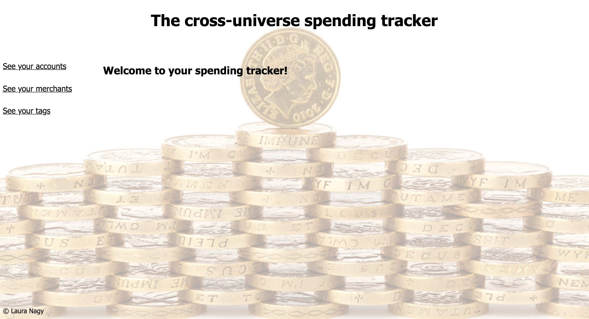
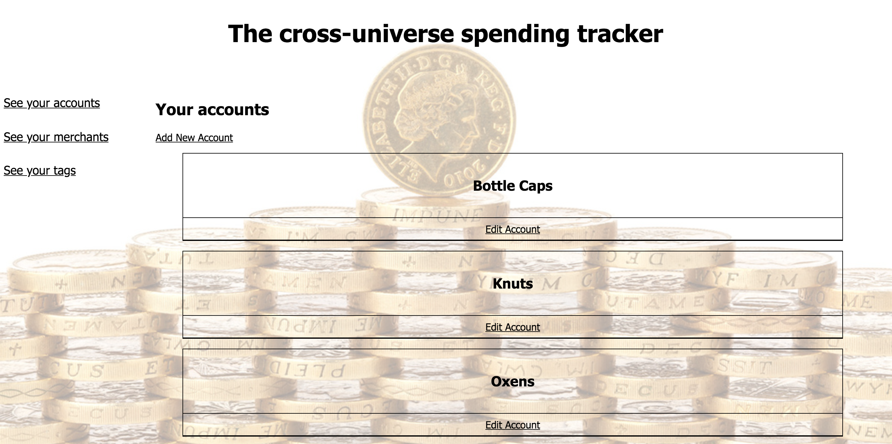
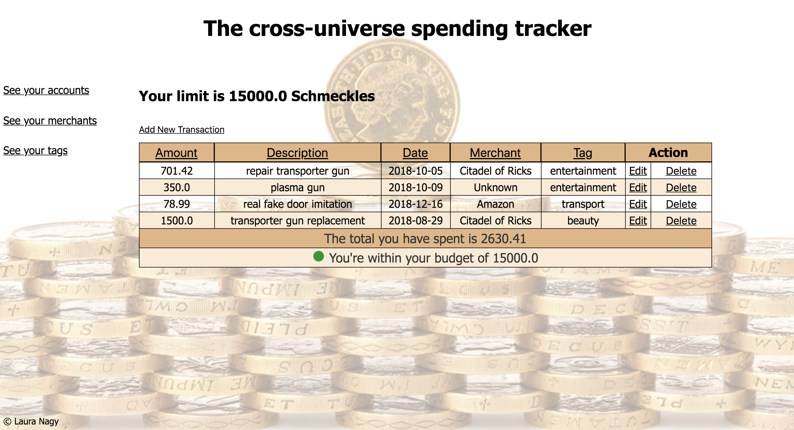

# Project: The Cross-Universe Spending Tracker- Web Programming with Ruby

This project is designed to illustrate an understanding of:

* Object oriented programming with Ruby
* Test Driven Development
* Web Programming (REST, MVC)
* Interacting with a PostgreSQL database (CRUD)

The project was built using only:

* HTML / CSS
* Ruby
* Sinatra
* PostgreSQL and the PG gem

We were **NOT** allowed to use:

* Any Object Relational Mapper (e.g. ActiveRecord)
* JavaScript
* Any pre-built CSS libraries, such as Bootstrap
* Authentication

## Brief

#### MVP

* The app should allow the user to create, edit and delete merchants, e.g. Tesco, Amazon, ScotRail
* The app should allow the user to create, edit and delete tags for their spending, e.g. groceries, entertainment, transport
* The user should be able to assign tags and merchants to a transaction, as well as an amount spent on each transaction.
* The app should display all the transactions a user has made in a single view, with each transaction's amount, merchant and tag, and a total for all transactions.

#### Possible Extensions

* Transactions should have a timestamp, and the user should be able to view transactions sorted by the time they took place.
* The user should be able to supply a budget, and the app should alert the user somehow when when they are nearing this budget or have gone over it.
* The user should be able to filter their view of transactions, for example, to view all transactions in a given month, or view all spending on groceries.

There are four classes:
 - Account
 - Merchant
 - Tag
 - Transaction

All four classes allow CRUD processes through REST-full routes, described in the controllers

*Screenshot of the final version of the home screen*

There are three main routes the user can view from the main screen: Accounts, Tags and Merchants.

*Screenshot of the main view of accounts*

All three routes are styles in a similar fashion. The main container which holds the type of account/tag/merchant is a link to a table of all transactions pertaining to that particular type. Below the main container is a smaller one which redirects the user to an edit form which also includes the option to delete that particular instance.
Upon deletion a transaction remains in the database and the field which was deleted gets replaced with 'Unknown'.

*Screenshot of transactions by account type*

The accounts provide the option to set a budget and a spending limit, depending on which the user gets a status display of either green (within spending limit) or red (above spending limit).
All the transactions are displayed in tables, which can be ordered alphabetically (or by most recent date).
